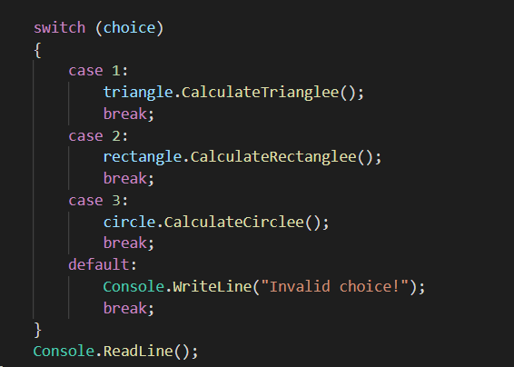
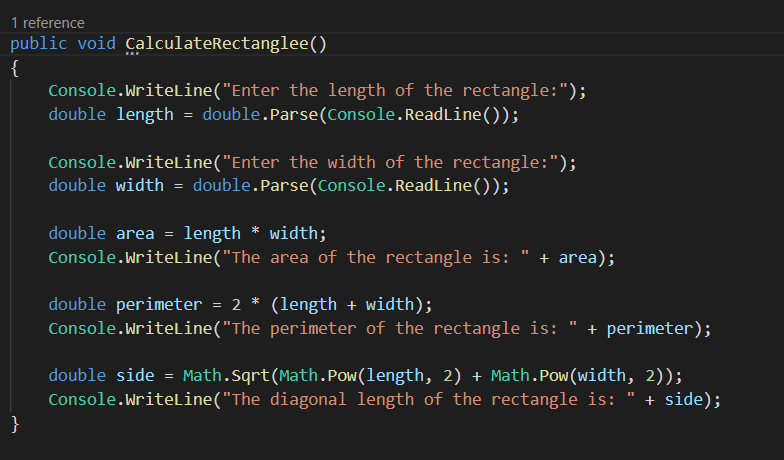

# Geometric Shapes Calculator
This program is a shape calculator that allows the user to calculate the area, perimeter, and other properties of different shapes such as triangles, rectangles, and circles.
***
What does this program do? let's find the answer with you.

+  the "choice" variable is used in the switch statement to determine which form to calculate. Based on the user's selection, the appropriate method (CalculateTriangle(), CalculateRectangle(), or CalculateCircle()) is called.
```
Console.WriteLine("Welcome to the Shape Calculator!");
Console.WriteLine("Which shape would you like to calculate?");
Console.WriteLine("3. Circle");
Console.WriteLine("1. Triangle");
Console.WriteLine("2. Rectangle");
```
+ a ```switch``` statement is used to determine the user's choice and execute the corresponding shape calculation method. If the user enters 
 1. the ```CalculateTriangle()``` method is called. If they enter .
 2. the ```CalculateRectangle()``` method is called. If they enter 
 3. the ```CalculateCircle()``` method is called. 
 4. If the user enters any other number, an error message is displayed.


+ For each shape calculation method (CalculateTriangle(), CalculateRectangle(), and CalculateCircle()), the user is prompted to enter the required dimensions for the shape (e.g., base length and height for a triangle, length and width for a rectangle, radius for a circle).
```
Circle
```

```
Triangle
```

```
Rectanglee
```

***
# Result:


***
+ Finally, the program waits for the user to press the Enter key before terminating.
+ This program uses basic input and output operations, mathematical operations, and conditional statements to perform shape calculations based on user input.